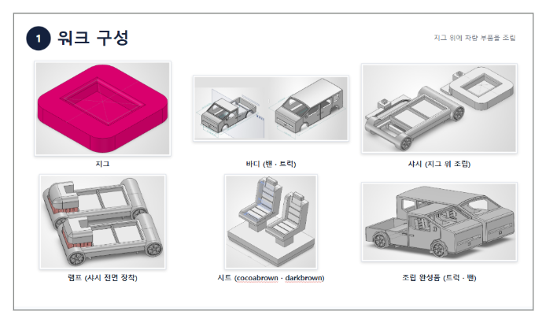

# project

## 프로젝트 소개
스마트팩토리
자동화 및 비전 검사 프로젝트입니다.

## 사용 기술
- Python / OpenCV / YOLO11n
- Mitsubishi PLC
- CIMON SCADA
- OPC-UA
- SolidWorks

## 주요 수행 업무
- 비전 검사 프로그램 개발
- 카메라 영상 분석 및 객체 검출
- 색상 검출을 통한 제품 유무 판정
- PLC 레더 동작 확인 및 수정 참여
- SolidWorks 부품 설계 및 3D 프린팅

## 프로젝트 사진

